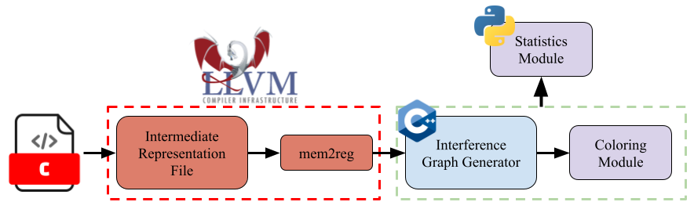

# Graph Coloring for Efficient Code Compilation

#### Large-scale LLVM-based interference graph generation for graph coloring




## <u>Important Content</u>
#### << *[Read the Full Paper](docs/Reports_and_Slides/Final_Report/DLOG_final_report.pdf)*
#### << *[Graph Generator](IG_Gen/generate_IR.cpp)*
#### << *[Sample Large Dataset](IG_Gen/DATASETv2)*

## <u>Build Instructions</u>

#### <u>Dependencies</u>

```bash 
  sudo apt install clang llvm opt
```

The provided Makefile is self-contained, and will compile the executable, then compile every file within a specified source directory, currently DATASETv2, to LLVM IR code. Following this, the executable will automatically be run in parallel upon every generated IR file, yielding output graph files in output_graph.

**Build + Run in parallel (N jobs):** 

```bash
  cd IG_Gen/
  make all -jN -k INP_DIR=/absolute/path/to/data/folder
```

**Clear Output + IR files + Object Files:**

```bash
  make clean_full
```

**Clear Object + IR Files:**
```bash
  make clean_ll
```

**Clear Object Files:**
```bash
  make clean
```

### <u>TODO</u>

* ~~Move methods to their own implementation files~~
* ~~Once the new file hierarchy is ironed out, edit makefile to work with that~~
* Implement ninja build system for large datasets
* ~~Add flags for generating statistics + coloring to speed up~~ (separate into methods & use #IFDEF)
  * Partially completed, still need to ensure functionality, eliminate redundancy, and streamline the flag setting process
  * Fix python script to account for the non recursed output
* Optimize basically everything
* Address completeness issues (look into LLVM documentation to ensure every keyword/case is covered)
* Add flag for automatically running python visualizer
* Website where you can drag + drop then get returned a zip file?